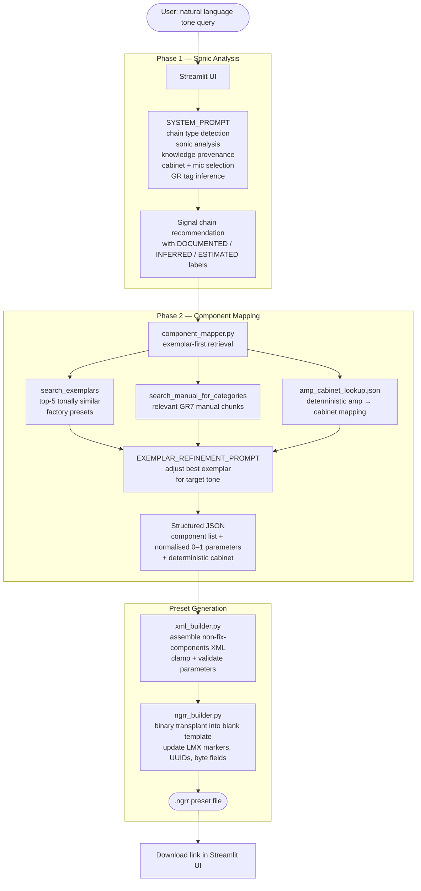
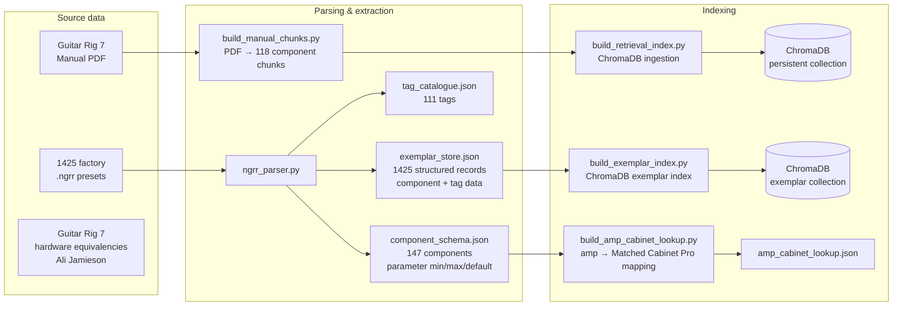

# ToneDef

> *"Give me Mark Knopfler from Dire Straits tone from the Brothers in Arms album"* → loadable Guitar Rig 7 preset, in seconds.

ToneDef is a GenAI application that bridges the gap between *wanting* a guitar tone and *having* it
loaded in your software. Describe a sound in natural language — referencing an artist, a recording,
or just a vibe — and it produces a downloadable Guitar Rig 7 preset file alongside a plain-language
explanation of what it built and why.

---

## What is Guitar Rig?

[Guitar Rig 7](https://www.native-instruments.com/en/products/komplete/guitar/guitar-rig-7-pro/) is
a guitar amp and effects emulation suite by Native Instruments. It models classic amplifiers, speaker
cabinets, stompboxes, and studio effects as software components that guitarists load into a virtual
signal chain. Presets are saved as `.ngrr` files — a proprietary binary format that bundles the
component configuration, parameter values, and metadata into a single file.

This is also a portfolio project demonstrating a multi-stage GenAI engineering pipeline: exemplar-first
RAG retrieval, binary file format reverse engineering, structured LLM output with few-shot grounding,
and a full offline data pipeline from raw presets to a searchable exemplar store.

---

## The problem

For non-guitarists: professional guitar players chase specific sounds obsessively. Getting the warm,
slightly broken-up tone from a 1965 recording, or the fizzy aggressive grind of a particular metal
album, requires knowing exactly what hardware was used, how it was configured, and which software
component best approximates it. Amp simulation software (Guitar Rig, Helix, etc.) has become
excellent — but it ships with 150+ components and thousands of parameters. The gap is not the
tools. It is knowing what to load.

The manual path looks like this: find gear documentation for the artist → identify which pedals and
amplifiers were used → find which Guitar Rig component maps to that hardware → configure each
knob based on documented settings or reasonable estimates. That is 30 minutes of research for a
single tone. ToneDef does it in seconds.

**What it does not do**: ToneDef is not a tone replication tool (it does its best...).
When you ask about a specific recording, it performs *gear archaeology* — an informed reconstruction
of what was likely used and why it sounds the way it does. Room acoustics, tape response, and vintage
component variation are not recoverable from gear documentation. The output is what is hopefully a
grounded starting point, not a forensic replica.

---

## What it produces

Given a query like *"I want the SRV Texas Blues tone"* or *"something super fizzy and trebly and
aggressive"*, ToneDef returns:

1. **A tone overview** — a narrative explanation of the sound: why a particular chain type was
   chosen, what makes this tone work, genre and character tags, and guitar/playing tips.
2. **A component-by-component breakdown** — each Guitar Rig 7 component shown as a styled card
   with its rationale, human-readable parameter values, modification type, and confidence level.
3. **A downloadable `.ngrr` preset file** — a valid Guitar Rig 7 preset the user drags straight
   into the software. Every component is matched, every knob is set.

Under the hood, Phase 1 also produces a detailed signal chain with hardware names and provenance
labels (`DOCUMENTED` / `INFERRED` / `ESTIMATED`) — this is available in the raw output expander
and drives the component mapping, but the primary UI presents the mapped GR7 components rather
than the intermediate hardware analysis.

---

## System architecture

### End-to-end pipeline



### Offline data pipeline

The runtime system depends on artefacts produced by an offline pipeline that runs once:



---

## Engineering highlights

### 1. Binary format reverse engineering

Guitar Rig 7 uses NI's proprietary Monolith container format (`.ngrr`). There is no public
documentation. To generate valid preset files, the format had to be reverse-engineered from
binary inspection of known-good files.

Key discoveries:
- The file embeds two XML blocks in a binary container — `guitarrig7-database-info` (metadata)
  and `non-fix-components` (the actual signal chain)
- Two `LMX` markers exist — one before each XML block — and both must be updated when XML size
  changes, or Guitar Rig 7 silently rejects the file on import
- Multiple `remaining-bytes` fields encode byte offsets from different anchor points in the file
- All preset components carry GUIDs that must be refreshed on generation
- The `transplant_preset()` approach (inject new XML into a known-good blank template) proved more
  reliable than constructing the binary envelope from scratch

This work lives in [`ngrr_parser.py`](src/tonedef/ngrr_parser.py) and
[`ngrr_builder.py`](src/tonedef/ngrr_builder.py).

### 2. Exemplar-first component mapping

Rather than mapping hardware names to GR7 components via a lookup table, ToneDef uses an
exemplar-first approach. Phase 2 retrieves the top-5 most tonally similar factory presets from a
ChromaDB exemplar index (1425 presets), retrieves relevant manual chunks for context, and asks the
LLM to adjust the best exemplar to match the target tone. The LLM modifies components and
parameters rather than building from scratch, producing more realistic and playable results.

A deterministic amp-to-cabinet lookup (`amp_cabinet_lookup.json`) ensures every amp is paired with
its correct Matched Cabinet Pro speaker — this is not left to LLM inference.

### 3. Stratified RAG retrieval

Phase 2 uses stratified retrieval across multiple ChromaDB collections:

**Exemplar search**: `search_exemplars()` queries the exemplar collection with the full Phase 1
signal chain to find the most tonally similar factory presets. These serve as starting points for
LLM refinement.

**Manual chunk search**: `search_manual_for_categories()` performs category-stratified retrieval
across the GR7 manual chunks (amps, effects, cabinets), ensuring each component type gets
represented in the context rather than allowing one dominant category to crowd out others.

### 4. Exemplar grounding

To prevent the LLM from hallucinating implausible parameter combinations, phase 2 prompts are
grounded with real examples. 1425 factory presets were parsed into structured records
(component lists, tags, metadata) and stored in `exemplar_store.json`. At inference time,
`search_exemplars()` retrieves the most tonally similar presets via ChromaDB search,
and `format_exemplar_context()` formats them as few-shot examples injected into
`EXEMPLAR_REFINEMENT_PROMPT`.

### 5. Prompt engineering

**SYSTEM_PROMPT** (Phase 1) is structured in named sections:
- `sonic_analysis` — builds an internal tonal profile before selecting any hardware (gain
  structure, frequency balance, dynamics, spatial character)
- `chain_type_detection` — classifies query as `AMP_ONLY` or `FULL_PRODUCTION` to scope the output
- `knowledge_transparency` — enforces the `DOCUMENTED / INFERRED / ESTIMATED` provenance taxonomy,
  with per-parameter `(estimated)` tagging where values are not from a verified source
- `cabinet_and_mic` — mandatory for all chain types; the model must always commit to a specific
  speaker cabinet and microphone placement rather than leaving it open
- `fallback_behaviour` — explicit cases for multi-era artists (use most-documented period),
  contradictory requirements (flag and resolve with stated interpretation), obscure recordings
  (best-effort LOW confidence)

**EXEMPLAR_REFINEMENT_PROMPT** (Phase 2) receives the Phase 1 signal chain, the top-5 exemplar
presets (with full component and parameter data), relevant manual chunks, the component schema,
and the amp-cabinet lookup table. It must select the best exemplar as a starting point, then adjust
components and parameters to match the target tone — outputting structured JSON with component ids,
names, and normalised 0–1 parameters.

### 6. Parameter value clamping

The component schema (built from parsing 1425 presets) records the observed min, max, and median
for every parameter of every component. `xml_builder.py` clamps all LLM-generated parameter values
to these ranges at assembly time, with a fallback to the schema median when no value is provided.
This prevents out-of-range values from causing GR7 to reject the preset.

---

## Repository structure

```
src/tonedef/
    ngrr_parser.py        parse .ngrr binary files → XML, component lists, metadata
    ngrr_builder.py       write .ngrr binary files — transplant, name update, UUID refresh
    xml_builder.py        assemble non-fix-components XML from component JSON
    component_mapper.py   phase 2 orchestrator — exemplar retrieval, LLM refinement, cabinet enforcement
    exemplar_store.py     build and query the preset exemplar dataset
    retriever.py          ChromaDB retrieval — exemplar search, manual chunk search, category-stratified search
    prompts.py            SYSTEM_PROMPT, EXEMPLAR_REFINEMENT_PROMPT
    paths.py              all filesystem paths in one place
    settings.py           configuration values

scripts/
    build_component_schema.py     parse presets → component_schema.json
    build_tag_catalogue.py        parse presets → tag_catalogue.json
    build_manual_chunks.py        chunk GR7 manual PDF → gr_manual_chunks.json
    build_retrieval_index.py      index manual chunks into ChromaDB
    build_exemplar_index.py       index factory presets → exemplar_store.json
    build_amp_cabinet_lookup.py   build amp → Matched Cabinet Pro lookup table
    check_pipeline.py             verify all pipeline artefacts exist

tests/                    329 tests, all passing
notebooks/marimo/         8 exploration and evaluation notebooks
data/
    external/presets/     1425 factory .ngrr presets (source data, read-only)
    processed/            component_schema.json, amp_cabinet_lookup.json, tag_catalogue.json,
                          exemplar_store.json, gr_manual_chunks.json, chromadb/
```

---

## Tech stack

| Layer | Technology |
|---|---|
| Interface | Streamlit |
| LLM | Anthropic Claude (claude-sonnet-4-6) |
| Vector store | ChromaDB |
| Notebooks | Marimo |
| Package management | uv |
| Linting / formatting | Ruff |
| Type checking | Mypy |
| Testing | pytest |

---

## Setup

```bash
git clone https://github.com/yourusername/tonedef.git
cd tonedef

uv sync

cp .env.example .env
# Add ANTHROPIC_API_KEY to .env

uv run streamlit run app.py
```

To rebuild the data pipeline from scratch (requires the factory presets and GR7 manual PDF):

```bash
uv run python scripts/build_component_schema.py
uv run python scripts/build_tag_catalogue.py
uv run python scripts/build_manual_chunks.py
uv run python scripts/build_retrieval_index.py
uv run python scripts/build_exemplar_index.py
uv run python scripts/build_amp_cabinet_lookup.py
```

---

## Roadmap

- **v0.4 — Iterative refinement**: chat-based follow-up queries ("make it brighter", "add more
  reverb") with diff-based preset editing and session state
- **Tavily RAG**: web retrieval to enrich phase 1 with live gear documentation; currently a
  `{{TAVILY_RESULTS}}` placeholder in SYSTEM_PROMPT, deferred as the system performs well
  without it
- **Multi-platform support**: extend preset generation to other amp emulation software (Helix
  Native, Amplitube, BIAS FX) by abstracting the binary builder and component schema layers
