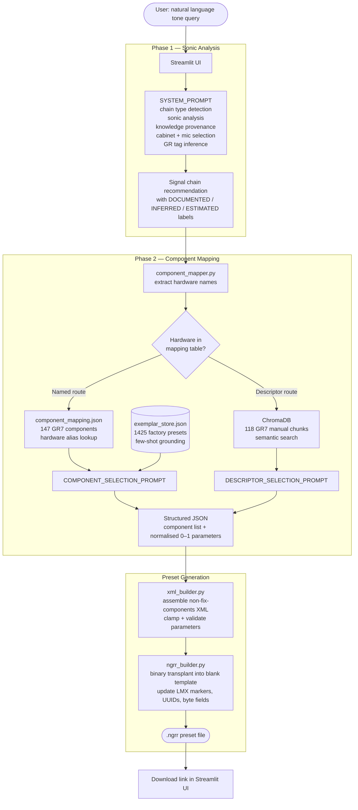
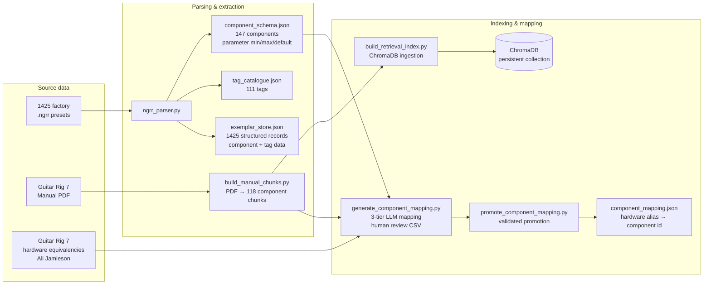

# ToneDef

> *"I want the tone from Where The Streets Have No Name"* → loadable Guitar Rig 7 preset, in seconds.

ToneDef is a GenAI application that bridges the gap between *wanting* a guitar tone and *having* it
loaded in your software. Describe a sound in natural language — referencing an artist, a recording,
or just a vibe — and it produces a downloadable Guitar Rig 7 preset file alongside a plain-language
explanation of what it built and why.

This is also a portfolio project demonstrating a multi-stage GenAI engineering pipeline: RAG with
dual retrieval routes, binary file format reverse engineering, structured LLM output with exemplar
grounding, and a full offline data pipeline from raw presets to a production mapping table.

---

## The problem

For non-guitarists: professional guitar players chase specific sounds obsessively. Getting the warm,
slightly broken-up tone from a 1965 recording, or the fizzy aggressive grind of a particular metal
album, requires knowing exactly what hardware was used, how it was configured, and which software
component best approximates it. Amp simulation software (Guitar Rig, Helix, etc.) has become
excellent — but it ships with 150+ components and thousands of parameters. The gap is not the
tools. It is knowing what to load.

The manual path looks like this: find gear documentation for the artist → identify which pedals and
amplifiers were used → find which Guitar Rig component maps to that hardware → configure each
knob based on documented settings or reasonable estimates. That is 30 minutes of research for a
single tone. ToneDef does it in seconds.

**What it does not do**: ToneDef is not a tone replication tool. When you ask about a specific
recording, it performs *gear archaeology* — an informed reconstruction of what was likely used
and why it sounds the way it does. Room acoustics, tape response, and vintage component variation
are not recoverable from gear documentation. The output is a grounded starting point, not a
forensic replica.

---

## What it produces

Given a query like *"I want the SRV Texas Blues tone"* or *"something super fizzy and trebly and
aggressive"*, ToneDef returns:

1. **A plain-language signal chain** — which hardware, in what order, with honest provenance labels
   (`DOCUMENTED` / `INFERRED` / `ESTIMATED`) distinguishing verified sources from informed guesses.
2. **A downloadable `.ngrr` preset file** — a valid Guitar Rig 7 preset the user drags straight
   into the software. Every component is matched, every knob is set.

---

## System architecture

### End-to-end pipeline



### Offline data pipeline

The runtime system depends on artefacts produced by an offline pipeline that runs once:



---

## Engineering highlights

### 1. Binary format reverse engineering

Guitar Rig 7 uses NI's proprietary Monolith container format (`.ngrr`). There is no public
documentation. To generate valid preset files, the format had to be reverse-engineered from
binary inspection of known-good files.

Key discoveries:
- The file embeds two XML blocks in a binary container — `guitarrig7-database-info` (metadata)
  and `non-fix-components` (the actual signal chain)
- Two `LMX` markers exist — one before each XML block — and both must be updated when XML size
  changes, or Guitar Rig 7 silently rejects the file on import
- Multiple `remaining-bytes` fields encode byte offsets from different anchor points in the file
- All preset components carry GUIDs that must be refreshed on generation
- The `transplant_preset()` approach (inject new XML into a known-good blank template) proved more
  reliable than constructing the binary envelope from scratch

This work lives in [`ngrr_parser.py`](src/tonedef/ngrr_parser.py) and
[`ngrr_builder.py`](src/tonedef/ngrr_builder.py).

### 2. Three-tier component mapping pipeline

Guitar Rig 7 has 147 components. Real-world gear documentation uses hundreds of different names
for the hardware those components emulate. Mapping these reliably required a tiered approach:

| Tier | Source | Method | Confidence |
|------|--------|--------|------------|
| 1 | Ali Jamieson guitar gear equivalencies | Direct lookup — unambiguous 1:1 mappings only | DOCUMENTED |
| 2 | GR7 manual text (118 chunks, ChromaDB) | LLM extraction from official component descriptions | DOCUMENTED / INFERRED |
| 3 | Component parameter list only | LLM inference from component name + parameter structure | INFERRED / ESTIMATED |

The pipeline (`generate_component_mapping.py`) produces a reviewable CSV before promotion to the
production JSON, allowing human validation of ambiguous mappings.

### 3. Dual-route RAG

Phase 2 uses two retrieval routes depending on whether the hardware name is in the mapping table:

**Named hardware route**: hardware name → `component_mapping.json` lookup → exact component id.
Used when the LLM's phase 1 output mentions gear that has a known equivalent (e.g. "Marshall
JCM800" → `804 Lead`).

**Descriptor route**: when hardware is unmapped or the query is purely descriptive, the component
name or sonic descriptor is used as a semantic query against the ChromaDB collection of GR7 manual
chunks. The retrieved context goes into `DESCRIPTOR_SELECTION_PROMPT` for LLM disambiguation.

### 4. Exemplar grounding

To prevent the LLM from hallucinating implausible parameter combinations, phase 2 prompts are
grounded with real examples. 1425 factory presets were parsed into structured records
(component lists, tags, metadata) and stored in `exemplar_store.json`. At inference time,
`search_exemplars()` retrieves the most tonally similar presets via stratified ChromaDB search
across tag categories, and `format_exemplar_context()` formats them as few-shot examples injected
into `COMPONENT_SELECTION_PROMPT`.

### 5. Prompt engineering

**SYSTEM_PROMPT** (Phase 1) is structured in named sections:
- `sonic_analysis` — builds an internal tonal profile before selecting any hardware (gain
  structure, frequency balance, dynamics, spatial character)
- `chain_type_detection` — classifies query as `AMP_ONLY` or `FULL_PRODUCTION` to scope the output
- `knowledge_transparency` — enforces the `DOCUMENTED / INFERRED / ESTIMATED` provenance taxonomy,
  with per-parameter `(estimated)` tagging where values are not from a verified source
- `cabinet_and_mic` — mandatory for all chain types; the model must always commit to a specific
  speaker cabinet and microphone placement rather than leaving it open
- `fallback_behaviour` — explicit cases for multi-era artists (use most-documented period),
  contradictory requirements (flag and resolve with stated interpretation), obscure recordings
  (best-effort LOW confidence)

**COMPONENT_SELECTION_PROMPT** (Phase 2) is the grounded mapping prompt. It receives the phase 1
output, the hardware index, retrieved manual chunks, and formatted exemplar presets. It must output
a structured JSON list — component id, component name, parameters as normalised floats.

### 6. Parameter value clamping

The component schema (built from parsing 1425 presets) records the observed min, max, and median
for every parameter of every component. `xml_builder.py` clamps all LLM-generated parameter values
to these ranges at assembly time, with a fallback to the schema median when no value is provided.
This prevents out-of-range values from causing GR7 to reject the preset.

---

## Repository structure

```
src/tonedef/
    ngrr_parser.py        parse .ngrr binary files → XML, component lists, metadata
    ngrr_builder.py       write .ngrr binary files — transplant, name update, UUID refresh
    xml_builder.py        assemble non-fix-components XML from component JSON
    component_mapper.py   phase 2 orchestrator — lookup, retrieve, LLM call, fill defaults
    exemplar_store.py     build and query the preset exemplar dataset
    retriever.py          ChromaDB retrieval — hardware search, descriptor search, exemplar search
    prompts.py            SYSTEM_PROMPT, COMPONENT_SELECTION_PROMPT, DESCRIPTOR_SELECTION_PROMPT
    paths.py              all filesystem paths in one place
    settings.py           configuration values

scripts/
    build_component_schema.py     parse presets → component_schema.json
    build_tag_catalogue.py        parse presets → tag_catalogue.json
    build_manual_chunks.py        chunk GR7 manual PDF → gr_manual_chunks.json
    generate_component_mapping.py LLM mapping generation → reviewable CSV
    promote_component_mapping.py  validate and promote reviewed CSV → component_mapping.json
    build_retrieval_index.py      index manual chunks into ChromaDB
    build_exemplar_index.py       index factory presets → exemplar_store.json

tests/                    106 tests, all passing
notebooks/marimo/         8 exploration notebooks
data/
    external/presets/     1425 factory .ngrr presets (source data, read-only)
    processed/            component_schema.json, component_mapping.json, tag_catalogue.json,
                          exemplar_store.json, gr_manual_chunks.json, chromadb/
```

---

## Tech stack

| Layer | Technology |
|---|---|
| Interface | Streamlit |
| LLM | Anthropic Claude (claude-sonnet-4-6) |
| Vector store | ChromaDB |
| Notebooks | Marimo |
| Package management | uv |
| Linting / formatting | Ruff |
| Type checking | Mypy |
| Testing | pytest |

---

## Setup

```bash
git clone https://github.com/yourusername/tonedef.git
cd tonedef

uv sync

cp .env.example .env
# Add ANTHROPIC_API_KEY to .env

uv run streamlit run app.py
```

To rebuild the data pipeline from scratch (requires the factory presets and GR7 manual PDF):

```bash
uv run python scripts/build_component_schema.py
uv run python scripts/build_tag_catalogue.py
uv run python scripts/build_manual_chunks.py
uv run python scripts/generate_component_mapping.py
# review data/interim/component_mapping_review.csv
uv run python scripts/promote_component_mapping.py
uv run python scripts/build_retrieval_index.py
uv run python scripts/build_exemplar_index.py
```

---

## Roadmap

- **V4 — Iterative refinement**: chat-based follow-up queries ("make it brighter", "add more
  reverb") with diff-based preset editing and session state
- **Tavily RAG**: web retrieval to enrich phase 1 with live gear documentation; currently a
  `{{TAVILY_RESULTS}}` placeholder in SYSTEM_PROMPT, deferred as the system performs well
  without it
